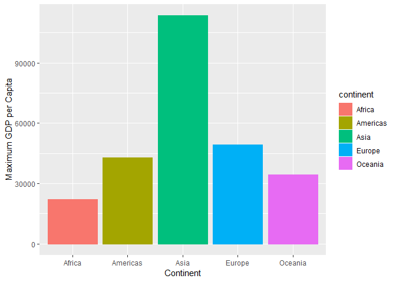
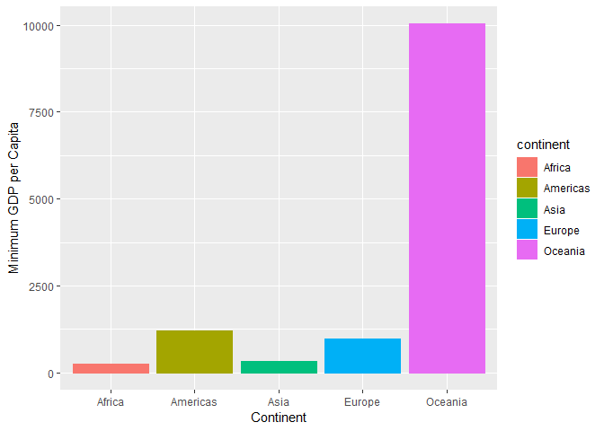
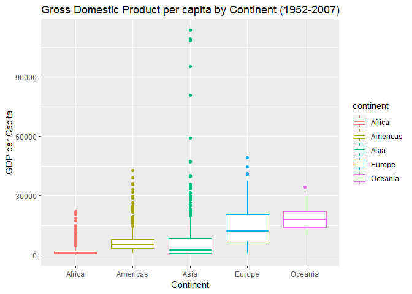
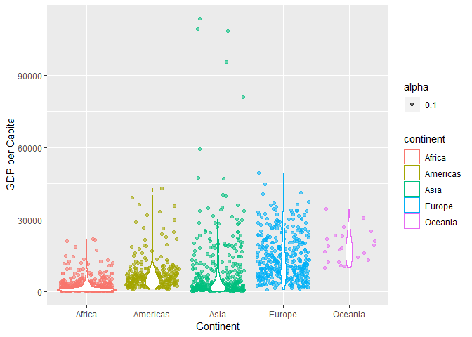
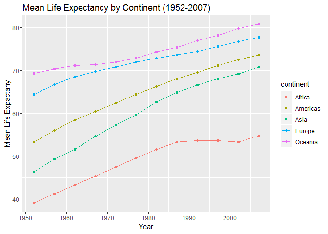

Homework 3
================
Stephen Chignell
October 2, 2018

Load Libraries
==============

``` r
suppressPackageStartupMessages(library(gapminder))
suppressPackageStartupMessages(library(tidyverse))
suppressPackageStartupMessages(library(ggplot2))
```

Exploration Tasks
=================

We will use the following sections to demonstrate a few common tasks used in data exploration. The will provide a useful reference for future work.

### 1. Get the maximum and minimum of GDP per capita for all continents

``` r
GDPmm <- gapminder %>% # begin pipe and assign output to variable "GDP"
  group_by(continent) %>% # group data by continent
  summarize(max.gdp = max(gdpPercap), # extract max using the max() function.
            min.gdp = min(gdpPercap)) # extract min using the min() function.
# Summarize() reduces a dataset down to just the specified values.
```

**Display the results as a table**

``` r
knitr::kable(GDPmm)
```

| continent |    max.gdp|     min.gdp|
|:----------|----------:|-----------:|
| Africa    |   21951.21|    241.1659|
| Americas  |   42951.65|   1201.6372|
| Asia      |  113523.13|    331.0000|
| Europe    |   49357.19|    973.5332|
| Oceania   |   34435.37|  10039.5956|

Plot using a barchart

``` r
ggplot(GDPmm, aes(continent, max.gdp))+
  geom_bar(stat = "identity", position = "dodge")+
  aes(color = continent, fill = continent)+
  xlab("Continent")+
  ylab("Maximum GDP per Capita")
```



``` r
ggplot(GDPmm, aes(continent, min.gdp))+
  geom_bar(stat = "identity")+
  aes(color = continent, fill = continent)+
  xlab("Continent")+
  ylab("Minimum GDP per Capita")
```



### 2. Look at the spread of GDP per capita within the continents

``` r
GDP_spread <- gapminder %>% 
  group_by(continent) %>% 
  summarize(mean.gdp = mean(gdpPercap),
            var.gdp = var(gdpPercap),
            sd.gdp = sd(gdpPercap)
            )
knitr::kable(GDP_spread)
```

| continent |   mean.gdp|    var.gdp|     sd.gdp|
|:----------|----------:|----------:|----------:|
| Africa    |   2193.755|    7997187|   2827.930|
| Americas  |   7136.110|   40918591|   6396.764|
| Asia      |   7902.150|  197272506|  14045.373|
| Europe    |  14469.476|   87520020|   9355.213|
| Oceania   |  18621.609|   40436669|   6358.983|

``` r
gapminder %>% 
  group_by(continent) %>% 
  ggplot(aes(continent, gdpPercap)) +
  geom_boxplot(aes(color = continent))+
  xlab("Continent")+
  ylab("GDP per Capita")+
  ggtitle("Gross Domestic Product per capita by Continent (1952-2007)")
```



However, a violin plot will provide a better sense of the spread:

``` r
gapminder %>% 
  group_by(continent) %>% 
  ggplot(aes(continent, gdpPercap))+
  geom_jitter(aes(color = continent, alpha=0.1))+
  geom_violin(aes(color = continent))+
  xlab("Continent")+
  ylab("GDP per capita")+
  ggtitle("Gross Domestic Product per capita by Continent (1952-2007)")
```



Here we see that GDP per capita varies widely within continents. This is particularly true for Asia, which has a far more extreme range than any of the other continents.

### 3. How is life expectancy changing over time on different continents?

For this question, we will first:

``` r
lexp <- gapminder %>% 
  group_by(continent, year) %>%
  summarize(mean.lexp = mean(lifeExp)) %>% 
  arrange(year)
knitr::kable(lexp)  
```

| continent |  year|  mean.lexp|
|:----------|-----:|----------:|
| Africa    |  1952|   39.13550|
| Americas  |  1952|   53.27984|
| Asia      |  1952|   46.31439|
| Europe    |  1952|   64.40850|
| Oceania   |  1952|   69.25500|
| Africa    |  1957|   41.26635|
| Americas  |  1957|   55.96028|
| Asia      |  1957|   49.31854|
| Europe    |  1957|   66.70307|
| Oceania   |  1957|   70.29500|
| Africa    |  1962|   43.31944|
| Americas  |  1962|   58.39876|
| Asia      |  1962|   51.56322|
| Europe    |  1962|   68.53923|
| Oceania   |  1962|   71.08500|
| Africa    |  1967|   45.33454|
| Americas  |  1967|   60.41092|
| Asia      |  1967|   54.66364|
| Europe    |  1967|   69.73760|
| Oceania   |  1967|   71.31000|
| Africa    |  1972|   47.45094|
| Americas  |  1972|   62.39492|
| Asia      |  1972|   57.31927|
| Europe    |  1972|   70.77503|
| Oceania   |  1972|   71.91000|
| Africa    |  1977|   49.58042|
| Americas  |  1977|   64.39156|
| Asia      |  1977|   59.61056|
| Europe    |  1977|   71.93777|
| Oceania   |  1977|   72.85500|
| Africa    |  1982|   51.59287|
| Americas  |  1982|   66.22884|
| Asia      |  1982|   62.61794|
| Europe    |  1982|   72.80640|
| Oceania   |  1982|   74.29000|
| Africa    |  1987|   53.34479|
| Americas  |  1987|   68.09072|
| Asia      |  1987|   64.85118|
| Europe    |  1987|   73.64217|
| Oceania   |  1987|   75.32000|
| Africa    |  1992|   53.62958|
| Americas  |  1992|   69.56836|
| Asia      |  1992|   66.53721|
| Europe    |  1992|   74.44010|
| Oceania   |  1992|   76.94500|
| Africa    |  1997|   53.59827|
| Americas  |  1997|   71.15048|
| Asia      |  1997|   68.02052|
| Europe    |  1997|   75.50517|
| Oceania   |  1997|   78.19000|
| Africa    |  2002|   53.32523|
| Americas  |  2002|   72.42204|
| Asia      |  2002|   69.23388|
| Europe    |  2002|   76.70060|
| Oceania   |  2002|   79.74000|
| Africa    |  2007|   54.80604|
| Americas  |  2007|   73.60812|
| Asia      |  2007|   70.72848|
| Europe    |  2007|   77.64860|
| Oceania   |  2007|   80.71950|

``` r
ggplot(data = lexp, aes(x = year, y = mean.lexp))+
  geom_line(aes(color = continent))+
  geom_point(aes(color = continent))+
  xlab("Year")+
  ylab("Mean Life Expactany")+
  ggtitle("Mean Life Expectancy by Continent (1952-2007)")
```



Here we see that on average, life expectancy has been increasing from 1952 to 2007. The one exception is Africa, which has remained relatively level from 1987 until a slight increase in 2007.

Also, it is interesting to see that there are no crossing of the continenents; they each remain in the same rank as they started in.
