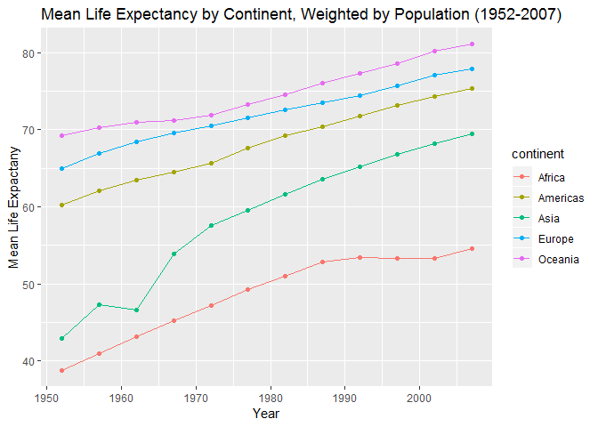

Homework 3
================
Stephen Chignell
October 2, 2018

Overview
========

The following sections demonstrates the `tidyverse` and `ggplot2` packages for filtering, organizing, and visualizing, using the `gapminder` dataset as an example.

Load Libraries
==============

First, we need to load the required libraries (install the packages beforehand if necessary).

``` r
suppressPackageStartupMessages(library(gapminder))
suppressPackageStartupMessages(library(tidyverse))
suppressPackageStartupMessages(library(ggplot2))
```

Exploration Tasks
=================

The following sections demonstrate a number of common tasks used in data exploration providing a useful reference for future work.

### 1. Get the maximum and minimum of GDP per capita for all continents

``` r
GDPmm <- gapminder %>% # begin pipe and assign output to variable "GDP"
  group_by(continent) %>% # group data by continent
  summarize(max.gdp = max(gdpPercap), # extract max using the max() function.
            min.gdp = min(gdpPercap)) # extract min using the min() function.
# Summarize() reduces a dataset down to just the specified values.
```

**Display the results as a table**

``` r
knitr::kable(GDPmm)
```

| continent |    max.gdp|     min.gdp|
|:----------|----------:|-----------:|
| Africa    |   21951.21|    241.1659|
| Americas  |   42951.65|   1201.6372|
| Asia      |  113523.13|    331.0000|
| Europe    |   49357.19|    973.5332|
| Oceania   |   34435.37|  10039.5956|

Let's make two barcharts to better visualize these.

**Max GDP by Continent**

``` r
ggplot(GDPmm, aes(continent, max.gdp))+
  geom_bar(stat = "identity")+
  aes(color = continent, fill = continent)+
  xlab("Continent")+
  ylab("Maximum GDP per Capita")
```


**Minimum GDP by Continent**

``` r
ggplot(GDPmm, aes(continent, min.gdp))+
  geom_bar(stat = "identity")+
  aes(color = continent, fill = continent)+
  xlab("Continent")+
  ylab("Minimum GDP per Capita")
```


### 2. Look at the spread of GDP per capita within the continents

To accompish this, we will filter the dataset and then apply a series of computations using the`summarize()` function:

``` r
GDP_spread <- gapminder %>% 
  group_by(continent) %>% 
  summarize(mean.gdp = mean(gdpPercap),
            var.gdp = var(gdpPercap),
            sd.gdp = sd(gdpPercap)
            )
knitr::kable(GDP_spread)
```

| continent |   mean.gdp|    var.gdp|     sd.gdp|
|:----------|----------:|----------:|----------:|
| Africa    |   2193.755|    7997187|   2827.930|
| Americas  |   7136.110|   40918591|   6396.764|
| Asia      |   7902.150|  197272506|  14045.373|
| Europe    |  14469.476|   87520020|   9355.213|
| Oceania   |  18621.609|   40436669|   6358.983|

To visualize the spread of these data, we can use a boxplot:

``` r
gapminder %>% 
  group_by(continent) %>% 
  ggplot(aes(continent, gdpPercap)) +
  geom_boxplot(aes(color = continent))+
  xlab("Continent")+
  ylab("GDP per Capita")+
  ggtitle("Gross Domestic Product per capita by Continent (1952-2007)")
```


The boxplot is useful, but a violin plot will provide a better visualization, since it shows all of the data points as well as the range:

``` r
gapminder %>% 
  group_by(continent) %>% 
  ggplot(aes(continent, gdpPercap))+
  geom_violin(aes(color = continent))+
  geom_jitter(aes(color = continent, alpha=0.1))+
  xlab("Continent")+
  ylab("GDP per capita")+
  ggtitle("Gross Domestic Product per capita by Continent (1952-2007)")
```

 Here we see that GDP per capita varies widely within continents. This is particularly true for Asia, which has a far more extreme range than any of the other continents.

One final adjustment to this chart would be to put the Y axis on a log10 scale, so that we can better visualize the data points that are clustered near the bottom:

``` r
gapminder %>% 
  group_by(continent) %>% 
  ggplot(aes(continent, gdpPercap))+
  geom_violin(aes(color = continent))+
  geom_jitter(aes(color = continent, alpha=0.1))+
  scale_y_log10()+
  xlab("Continent")+
  ylab("GDP per capita")+
  ggtitle("Gross Domestic Product per capita by Continent (1952-2007)")
```

 **Note** There is a tradeoff between the log10 plot and the previous plot, in that the former makes the differences between the ranges less obvious, but has the advantage of showing the "shape" of the violins, which is not possible on the normal y-axis. The ultimate choice should be based on the message that is most important to communicate for the question at hand.

### 3. How is life expectancy changing over time on different continents?

For this question, we will group and summarize the data, and then compute the mean life expectancy, weighted by population:

``` r
lexp <- gapminder %>% 
  group_by(continent, year) %>% #group by continent and year
  summarize(wmean.lexp = weighted.mean(lifeExp,pop)) %>% #weighted mean by population
  arrange(year) #arrange in ascending order by year
knitr::kable(lexp)  #output to table
```

| continent |  year|  wmean.lexp|
|:----------|-----:|-----------:|
| Africa    |  1952|    38.79973|
| Americas  |  1952|    60.23599|
| Asia      |  1952|    42.94114|
| Europe    |  1952|    64.90540|
| Oceania   |  1952|    69.17040|
| Africa    |  1957|    40.94031|
| Americas  |  1957|    62.01806|
| Asia      |  1957|    47.28835|
| Europe    |  1957|    66.89364|
| Oceania   |  1957|    70.31693|
| Africa    |  1962|    43.09925|
| Americas  |  1962|    63.43706|
| Asia      |  1962|    46.57369|
| Europe    |  1962|    68.45957|
| Oceania   |  1962|    70.98808|
| Africa    |  1967|    45.17721|
| Americas  |  1967|    64.50630|
| Asia      |  1967|    53.88261|
| Europe    |  1967|    69.54963|
| Oceania   |  1967|    71.17848|
| Africa    |  1972|    47.21229|
| Americas  |  1972|    65.70490|
| Asia      |  1972|    57.52159|
| Europe    |  1972|    70.46884|
| Oceania   |  1972|    71.92273|
| Africa    |  1977|    49.20883|
| Americas  |  1977|    67.60591|
| Asia      |  1977|    59.55648|
| Europe    |  1977|    71.53989|
| Oceania   |  1977|    73.25684|
| Africa    |  1982|    51.01744|
| Americas  |  1982|    69.19264|
| Asia      |  1982|    61.57472|
| Europe    |  1982|    72.56247|
| Oceania   |  1982|    74.58291|
| Africa    |  1987|    52.82479|
| Americas  |  1987|    70.35814|
| Asia      |  1987|    63.53710|
| Europe    |  1987|    73.44717|
| Oceania   |  1987|    75.98107|
| Africa    |  1992|    53.37292|
| Americas  |  1992|    71.72177|
| Asia      |  1992|    65.14874|
| Europe    |  1992|    74.44273|
| Oceania   |  1992|    77.35788|
| Africa    |  1997|    53.28327|
| Americas  |  1997|    73.19154|
| Asia      |  1997|    66.77092|
| Europe    |  1997|    75.70849|
| Oceania   |  1997|    78.61843|
| Africa    |  2002|    53.30314|
| Americas  |  2002|    74.24736|
| Asia      |  2002|    68.13732|
| Europe    |  2002|    77.02232|
| Oceania   |  2002|    80.16006|
| Africa    |  2007|    54.56441|
| Americas  |  2007|    75.35668|
| Asia      |  2007|    69.44386|
| Europe    |  2007|    77.89057|
| Oceania   |  2007|    81.06215|

The above table provides all of the data, but is not easy to use for picking out patterns. Let's plot the data throught time:

``` r
ggplot(data = lexp, aes(x = year, y = wmean.lexp))+ 
  geom_line(aes(color = continent))+
  geom_point(aes(color = continent))+
  xlab("Year")+
  ylab("Mean Life Expactany")+
  ggtitle("Mean Life Expectancy by Continent, Weighted by Population (1952-2007)")
```



Here we see that on average, life expectancy has been increasing from 1952 to 2007. The one exception is Africa, which has remained relatively level from 1987 until a slight increase in 2007.

Also, it is interesting to see that there is no crossing of continent rankings. In other words, each continent remains in the same relative position throughout the entire data record.
