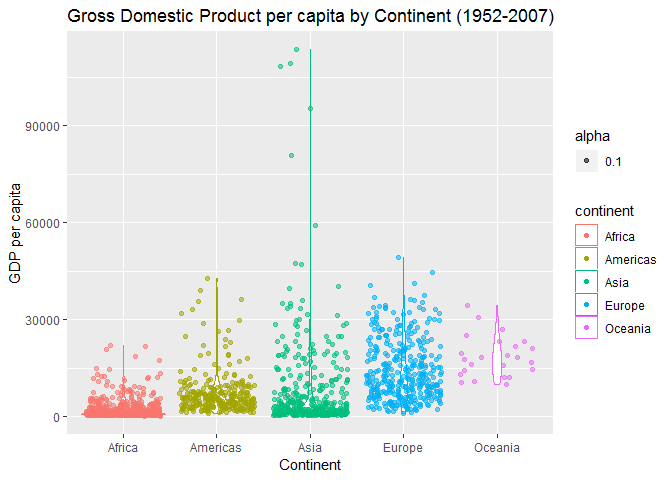

Homework 3
================
Stephen Chignell
October 2, 2018

Load Libraries
==============

``` r
suppressPackageStartupMessages(library(gapminder))
suppressPackageStartupMessages(library(tidyverse))
suppressPackageStartupMessages(library(ggplot2))
```

Exploration Tasks
=================

We will use the following sections to demonstrate a few common tasks used in data exploration. The will provide a useful reference for future work.

### 1. Get the maximum and minimum of GDP per capita for all continents

``` r
GDPmm <- gapminder %>% # begin pipe and assign output to variable "GDP"
  group_by(continent) %>% # group data by continent
  summarize(max.gdp = max(gdpPercap), # extract max using the max() function.
            min.gdp = min(gdpPercap)) # extract min using the min() function.
# Summarize() reduces a dataset down to just the specified values.
```

**Display the results as a table**

``` r
knitr::kable(GDPmm)
```

| continent    |    max.gdp|     min.gdp|
|:-------------|----------:|-----------:|
| Africa       |   21951.21|    241.1659|
| Americas     |   42951.65|   1201.6372|
| Asia         |  113523.13|    331.0000|
| Europe       |   49357.19|    973.5332|
| Oceania      |   34435.37|  10039.5956|
| Plot using a |   barchart|            |

``` r
ggplot(GDPmm, aes(continent, max.gdp))+
  geom_bar(stat = "identity", position = "dodge")+
  aes(color = continent, fill = continent)+
  xlab("Continent")+
  ylab("Maximum GDP per Capita")
```


``` r
ggplot(GDPmm, aes(continent, min.gdp))+
  geom_bar(stat = "identity")+
  aes(color = continent, fill = continent)+
  xlab("Continent")+
  ylab("Minimum GDP per Capita")
```


### 2. Look at the spread of GDP per capita within the continents

``` r
GDP_spread <- gapminder %>% 
  group_by(continent) %>% 
  summarize(mean.gdp = mean(gdpPercap),
            var.gdp = var(gdpPercap),
            sd.gdp = sd(gdpPercap)
            )
GDP_spread
```

    ## # A tibble: 5 x 4
    ##   continent mean.gdp    var.gdp sd.gdp
    ##   <fct>        <dbl>      <dbl>  <dbl>
    ## 1 Africa       2194.   7997187.  2828.
    ## 2 Americas     7136.  40918591.  6397.
    ## 3 Asia         7902. 197272506. 14045.
    ## 4 Europe      14469.  87520020.  9355.
    ## 5 Oceania     18622.  40436669.  6359.

``` r
gapminder %>% 
  group_by(continent) %>% 
  ggplot(aes(continent, gdpPercap)) +
  geom_boxplot(aes(color = continent))+
  xlab("Continent")+
  ylab("GDP per Capita")
```


However, a violin plot will provide a better sense of the spread:

``` r
gapminder %>% 
  group_by(continent) %>% 
  ggplot(aes(continent, gdpPercap)) +
  geom_jitter(aes(color = continent, alpha=0.1))+
  geom_violin(aes(color = continent))+
  xlab("Continent")+
  ylab("GDP per Capita")
```


